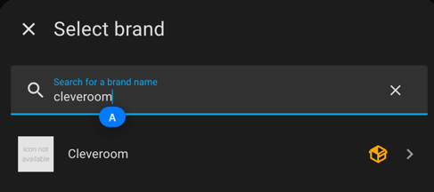
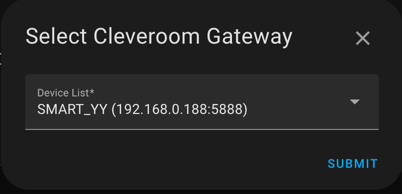
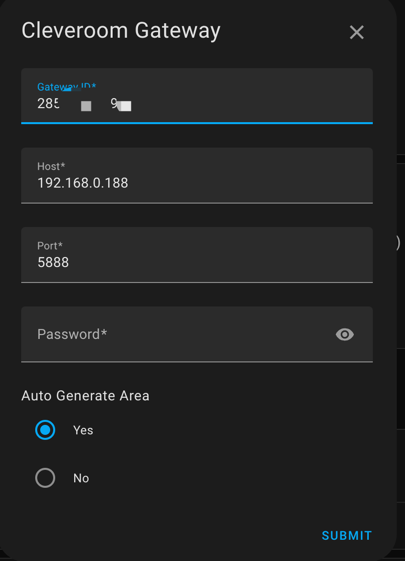
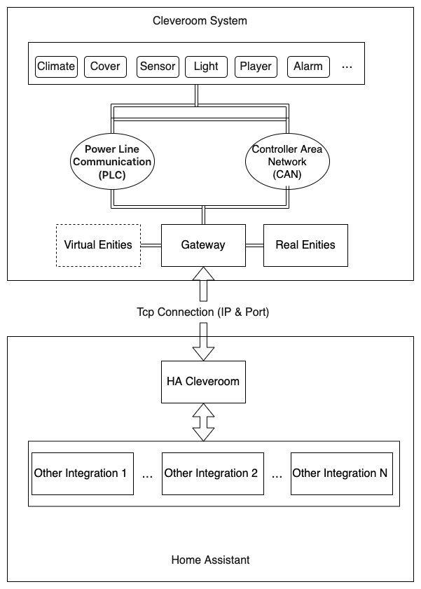

# Cleveroom Smart Home System Integration for Home Assistant

[English](./README.md) | [简体中文](./README_zh-CN.md)

Note:This English translation was generated from the Chinese original using DeepSeek. Should you find the English unclear, we recommend using an alternative translation tool to convert the original Chinese into a language more readily understandable to you.

[](https://github.com/hacs/integration)


This is a plugin for Home Assistant that allows you to integrate devices from the Cleveroom smart home system for control and management within Home Assistant.

---

##Online Installation

- 1.  In HACS -> Custom Repositories, add the plugin's `repository` as "https://github.com/cleveroom-code/ha-cleveroom-home" and select the category as `Integration`. Choose the plugin named `Cleveroom` and click Download to install.

- 2.  Restart Home Assistant.

## Offline Installation

- 1. Due to network restrictions, installing dependencies through HACS or offline methods can be challenging. To ensure plugin availability, we have bundled all required dependencies into the plugin. Please follow these steps:

```bash
#Download necessary plugins
pip install -r requirements.txt -t ./releases/libs
#Package the plugin
python3 package-addon.py
```
- 2. After completing the above steps, an offline installation package will be generated in the releases directory, named cleveroom-1.0.0.zip. Upload this package to the Home Assistant /config/custom_components directory.
- 3. Extract the cleveroom-1.0.0.zip package, which will create a cleveroom directory. Place this directory in the /config/custom_components directory. Note that the cleveroom directory must contain an init.py file. If this file is missing or there are extra folders, please address this accordingly.
- 4. Restart Home Assistant.
- 5Navigate to Settings > Devices & Services > Add Integration > Cleveroom. The Cleveroom configuration interface will appear.

---
## Network

The interaction between the Cleveroom system and HomeAssistant uses TCP, and it's necessary to ensure that the plugin carrier device and the Cleveroom system gateway are on the same local network. If deploying using Docker, change the network mode to host, because device discovery uses UDP multicast, and you need to be in host mode to receive messages from the gateway.

## Configuration

- 1.  In System Settings > Devices & Services > Add Integration > `Cleveroom`. The `Cleveroom` configuration interface will pop up.



- 2.  Select the Cleveroom gateway device found in the local network. Select the device and proceed to the next step, or skip device selection and manually enter the information by clicking next.

!

- 3.  Selecting the gateway and proceeding to the next step will automatically populate the gateway's IP address, port number, authorization code, and password information.



- 4.  If you need to create floors and rooms according to the area structure of the Cleveroom system, select "Automatically Generate Areas". If not, select "Do Not Automatically Generate Rooms".

- 5.  Click Finish. Initialization may take 5-7 seconds to load the data.


Note: Before integrating devices into Home Assistant, please ensure that the Cleveroom system is debugged and functioning properly. This step is very important and can reduce your configuration time.

---

## Supported Features

### Light

    Supports on/off, dimming, color temperature adjustment, and color adjustment functions.

### Switch

    Supports on/off control, such as for some sockets and appliances.

### Sensor

    Supports temperature, humidity, illuminance, PM2.5, PM10, CO2, VOC, formaldehyde, wind speed, rainfall, atmospheric pressure, and other sensors.

### Binary Sensor

    Supports door/window sensors, smoke detectors, gas detectors, human presence sensors, and the connection of any dry contacts with binary states.

### Climate

    Supports the integration of air conditioning and underfloor heating equipment, allowing for temperature control, fan speed adjustment, airflow direction control, on/off switching, and other operations.

### Cover

    Supports the integration of curtains, blinds, roller shutters, and other equipment, allowing for open, close, stop, and percentage-based control functions.

### Fan

    Supports the integration of ventilation systems, allowing for on/off switching and fan speed control functions.

### Scene

    Supports the integration of Cleveroom's built-in scene modes, allowing for triggering operations.

### Media Player

    Supports the integration of Cleveroom's built-in speakers, allowing for volume control, play, pause, previous track, next track, folder switching, and audio source switching operations.

### Alarm Control Panel

    Supports the integration of Cleveroom's built-in security alarms, allowing for arming, disarming, and arming status query operations.

### Button

    Buttons serve as the entry point for triggering actions. Supports 3-button type entities, which respectively implement three functions: clearing the plugin cache, searching for devices, and reloading the plugin. These are supplementary operations for the plugin. These functions are used more frequently during initial integration and less frequently after the system is stable.

---

## System Interaction



The Cleveroom system employs a wired architecture for its smart home network, offering two bus options: CANBUS, known for its stability and reliability, and Power Line Communication (PLC), which simplifies installation, particularly in retrofit scenarios. A combined CANBUS/PLC architecture is also available. These architectures support identical device modules and present a unified interface to external systems.

Explanation:

- 1.  After the Cleveroom plugin is loaded, it will automatically connect to the Cleveroom gateway. When the network is abnormal, it will attempt to reconnect to the gateway every 15 seconds.
- 2.  After the plugin is loaded, it will automatically search for devices in the Cleveroom system. The found devices will generate corresponding entities in Home Assistant. If the entities already exist in the system, the plugin will update their states and notify the state machine to refresh the states.
- 3.  If an entity is operated in Home Assistant, the plugin will send the operation command to the Cleveroom gateway. The gateway will forward the command to the corresponding device for execution. When the state of a device in the system changes, the gateway will push the state change to the plugin, and the plugin will update the state change in Home Assistant.
- 4.  Although Cleveroom maintains a long connection to update the status in real-time, the function of automatically refreshing the status every 30 seconds is retained to prevent status synchronization problems caused by network abnormalities or gateway disconnections.
- 5.  The Cleveroom system has two concepts: physical devices and virtual devices. A physical device is a device that actually exists in the Cleveroom system. A virtual device is a mapping of an external device in the Cleveroom system. The Cleveroom system controls the devices of external systems in conjunction by controlling virtual devices.
- 6.  Both physical and virtual devices in the Cleveroom system can be controlled in Home Assistant. The control of physical devices will be sent directly to the Cleveroom system, and the control of virtual devices will first be sent to the Cleveroom system and then forwarded to the external system by the Cleveroom system.
- 7.  The creation and deletion of virtual devices needs to be done in the Cleveroom system. The plugin will automatically search for virtual devices and generate corresponding entities in Home Assistant. Third-party devices can listen to the state changes of virtual devices to realize联动, or they can realize 联动 through the control of virtual devices.